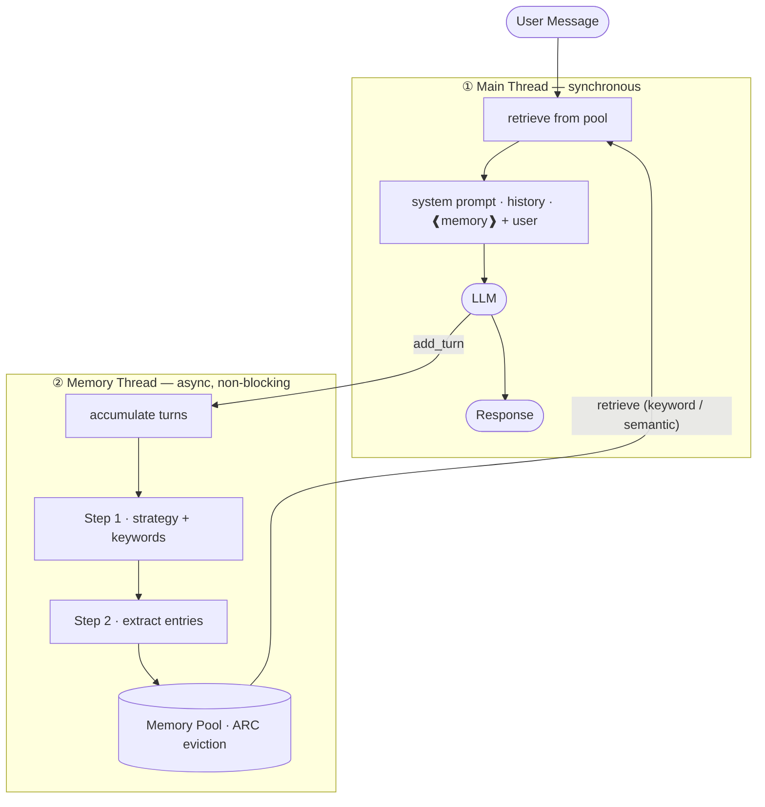

# LLM Memory Pool

A novel memory architecture for long-running LLM conversations — running a parallel async compression thread alongside the main dialogue, with keyword-indexed retrieval and KV-cache-aware injection.

---

## Inspiration: Human Memory

This system is designed to mirror the way human memory actually works — not as an exact replica, but as a faithful approximation of its key properties.

### Thinking and remembering happen in parallel

Humans do not pause a conversation to consolidate memory. While you are speaking, listening, and responding, a background cognitive process is simultaneously encoding what matters into long-term memory. You are not aware of this happening — it runs concurrently with conscious thought.

This system works the same way. The **main thread** handles the live conversation without interruption. The **memory thread** runs asynchronously alongside it, compressing completed turns into the memory pool. The two threads never block each other.

### Memory is topic-biased, not complete

Human memory does not record everything with equal fidelity. What you were thinking about at the time of encoding strongly determines what gets retained. Information that is relevant to your current focus is consolidated; information that is peripheral or unrelated fades.

This system applies the same principle during retrieval. When injecting memories into a new turn, entries are scored against the **current topic** of the user's message. Memories relevant to what is being discussed now receive a relevance bonus and are prioritized. Unrelated memories — even if they exist in the pool — may not be injected if they fall below the budget threshold.

The pool's eviction policy reinforces this: entries that are rarely recalled (low frequency) and not recently relevant (low recency) are evicted first. They are forgotten, just as peripheral human memories are.

### Perfect recall is not the goal

Human memory is reconstructive and lossy. You do not remember everything, and that is not a failure — it is an efficient design. The brain retains what is likely to be useful again, based on patterns of past use.

This system takes the same position. A memory pool with a capacity limit and a principled eviction strategy is not a bug — it is the intended behavior. The goal is **useful recall**, not total recall.

### Overload: when forgetting is the right answer

If information arrives too fast and in too great a volume for the compression thread to keep up, pending turns are dropped rather than queued indefinitely. This is a deliberate design choice.

A human subjected to an extreme rate of information input — rapid-fire conversation, dozens of simultaneous messages — also cannot form reliable memories of the details. Attempting to force retention under overload produces degraded, unreliable memories that may be worse than no memory at all.

When the system is overwhelmed, it does the same thing a human does: it lets go. The conversation continues uninterrupted. Some turns are not compressed into the pool. This is acceptable.

```
Overload condition:
  compression thread busy + new turns arriving faster than processing rate
  → excess turns are dropped (not queued, not blocking)
  → main conversation continues unaffected
  → this mirrors human cognitive behavior under information overload
```

### Summary of the analogy

| Human memory | This system |
|---|---|
| Background consolidation during conversation | Async compression thread running in parallel |
| Encodes what is relevant to current thinking | Topic-scored retrieval; relevance bonus in eviction |
| Peripheral information fades over time | LRU + frequency eviction from pool |
| Does not aim for 100% recall | Capacity-limited pool; inject budget per turn |
| Degrades gracefully under information overload | Drops excess turns rather than blocking |

---

## The Problem

Every LLM has a fixed context window. As a conversation grows, you face a hard choice:

| Strategy | Problem |
|---|---|
| Truncate old turns | AI forgets what was said earlier |
| Summarize everything into system prompt | KV cache invalidates every turn → slow & expensive |
| Use RAG / vector DB | Requires embedding infrastructure, overkill for single-session memory |
| Send full history | Hits context limit; expensive per-token cost |

None of these are designed for the specific characteristics of **conversational memory** — information that is session-specific, evolves with each turn, and needs to be recalled quickly without disrupting the model's caching behavior.

---

## Core Idea

Run two threads simultaneously:



The **main thread** handles the live conversation. The **memory thread** asynchronously compresses older turns into a keyword-indexed pool, then injects relevant memories into the next user message — without ever modifying the system prompt.

---

## Why This Works: KV Cache Preservation

Modern LLM inference engines (vLLM, TensorRT-LLM, Gemini's internal caching) cache the key-value attention states of the **prefix** of each prompt. If the prefix is identical between consecutive turns, the engine reuses the cached states and skips recomputation — reducing latency and cost.

The standard mistake is putting dynamic memory into the system prompt:

```
# BAD — system prompt changes every turn → cache miss from position 0 every time
Turn N:   [system + memory_N]  [msg1][rpl1] ... [msgN]
Turn N+1: [system + memory_N+1][msg1][rpl1] ... [msgN][rplN][msgN+1]
           ^^^^^^^^^^^^^^^^^^^^^^^^
           changed → entire prefix invalid → full recompute
```

This implementation keeps the system prompt **completely static**. Memory is prepended only to the **current user message**:

```
# GOOD — system prompt never changes → its cache is always valid
Turn N:   [system]  [msg1][rpl1]...[msgN-1][rplN-1]  [memory_N + msgN]
Turn N+1: [system]  [msg1][rpl1]...[msgN-1][rplN-1]  [memory_N + msgN][rplN]  [memory_N+1 + msgN+1]
           ^^^^^^^  ^^^^^^^^^^^^^^^^^^^^^^^^^^^^^^^^^^^^^^^^^^^^^^^^^^^^
           cached   cached from Turn N                                          only this is new
```

The conversation history grows by two entries each turn (one user, one assistant). Only those two new entries require computation — everything before them is already cached. The system prompt cache is never invalidated.

Contrast this with injecting memory into the system prompt: every turn changes the system prompt, which invalidates the entire prefix cache and forces a full recompute from position 0.

---

## Memory Pool Architecture

### Storage

The pool is a flat array of `MemoryEntry` objects:

```typescript
interface MemoryEntry {
  keyword: string           // primary topic key
  content: string           // compressed summary (< 50 words)
  relatedKeywords: string[] // secondary match keys
  embedding?: number[]      // optional: 384-dim sentence embedding (all-MiniLM-L6-v2)
  lastUsed: number          // timestamp for recency scoring
  useCount: number          // access count for frequency scoring
  createdAtTurn: number     // when this memory was created
}
```

The `embedding` field is optional — the system works without it (keyword fallback), and enriches retrieval with semantic similarity when an embedding engine is available.

### Eviction: ARC Cache-Inspired Scoring

When the pool reaches capacity, the lowest-scoring entry is evicted. The score combines three signals:

```
score = recency + frequency × 0.5 + relevance

recency   = 1 / (1 + age_in_minutes)              # exponential decay
frequency = log(1 + useCount) × 0.5               # log-scaled access count
relevance = cosine(query_emb, entry_emb) × 2      # semantic similarity  [if embeddings available]
          = 1.5  if keyword string-matches query   # keyword fallback     [if no embeddings]
          = 0.0  otherwise
```

This is inspired by **ARC (Adaptive Replacement Cache)** — balancing recency (LRU) with frequency (LFU). Memories that are frequently recalled and recently accessed survive; stale, rarely-used entries are evicted first.

### Two-Step Compression

Compressing raw conversation turns into structured memory entries is done in two LLM calls:

**Step 1 — Strategy determination:**
```
Input:  raw conversation turns
Output: { strategy: "...", keywords: ["kw1", "kw2", ...] }
```

The model identifies what *kind* of information is present and which topics to focus on. This prevents the compression step from being unfocused.

**Step 2 — Memory entry generation:**
```
Input:  strategy + keywords + raw turns
Output: { entries: [{ keyword, content, relatedKeywords }] }
```

The model produces structured, concise summaries targeted at the identified topics. Each entry is capped at 50 words to keep the injection budget manageable.

After the two LLM calls, each entry's content is embedded and stored alongside it. These embeddings are computed in parallel and do not block the compression pipeline.

A smaller, faster model handles compression (e.g. `gemma-4-26b-a4b-it`) while a larger model handles the main dialogue (`gemma-4-31b-it`). This is intentional: compression is a structured extraction task that does not require the full capability of the main model.

### Retrieval

At the start of each turn, the user's message is embedded and scored against all entries in the pool:

```
user message → embed → cosine similarity vs. all entries → ARC score → fill inject budget
```

Semantic retrieval catches synonyms and related concepts that keyword matching would miss. A user asking about "my car" will retrieve a memory entry about "automobile" without needing an exact string match.

When the embedding engine has not yet finished loading, the system falls back to keyword matching automatically — retrieval is never blocked.

### In-Browser Embedding Engine (Pure Frontend)

The pure frontend version runs an embedding model directly in the browser using [Transformers.js](https://github.com/xenova/transformers.js) and ONNX Runtime Web — no server required.

**Model:** `Xenova/all-MiniLM-L6-v2`
- 22 MB download on first use, then cached in browser (via Cache API)
- 384-dimensional sentence embeddings
- Inference: ~20–50ms per entry on a modern laptop
- Runs entirely on the CPU via WebAssembly; no GPU needed

**Lifecycle:**

```
Page load
  ├── Chat UI becomes available immediately (no waiting)
  └── Embedding model loads in background
        ├── While loading: keyword fallback for retrieval
        └── Once ready: all future entries get embeddings; retrieval switches to cosine similarity
```

Entries created before the model is ready store `embedding: null`. Entries created after store a full 384-dim vector. Both coexist in the pool — the scoring function handles both cases gracefully.

The pool tab shows a `⊕ embed` badge on entries that have a stored embedding, making it easy to see which entries are using semantic retrieval.

---

## Session-Specific Memory Principle

A key design constraint: **only compress information that doesn't exist outside this conversation.**

The compression prompt instructs the model to ignore general world knowledge (geography, science, historical facts) and focus on:

- User identity and context (name, role, goals)
- Decisions made in this session
- User preferences expressed during the conversation
- Project-specific details unique to this dialogue

This avoids wasting pool space on facts the model already knows from pretraining, and keeps memories genuinely personal to the session.

---

## What About Different Models for Compression vs. Chat?

If the compression model and the chat model have different pretraining knowledge, could a memory entry state something the chat model considers incorrect?

In practice, this risk is low because:

1. The session-specific filter excludes world knowledge — memories only contain user-stated facts, not inferred facts.
2. The compression model's role is *extraction*, not *inference*. It packages what the user said, not what it believes.
3. Both models share the same base training distribution for common entities.

The correct defense is to phrase memory entries as **user-stated facts**, not general truths: `"User said they work in Tokyo"` rather than `"Tokyo is in Japan"`.

---

## Parameters

| Parameter | Default | Effect |
|---|---|---|
| `maxRawTurns` | 4 | Turns kept in live context. Keep small to force memory usage. |
| `minTurnsToCompress` | 2 | Turns accumulated before compression fires. Must be < `maxRawTurns`. |
| `maxPoolEntries` | 100 | Pool capacity before eviction kicks in. |
| `injectBudget` | 800 | Max characters of memory injected per turn. |

**Critical relationship:** `minTurnsToCompress` must be significantly less than `maxRawTurns`. If they are equal, turns fall out of the live context before the compression thread has processed them — the AI forgets before memory is written.

---

## Verified Result

With `maxRawTurns=4` and `minTurnsToCompress=2`, the system was tested as follows:

1. Turn 0: User introduces themselves ("My name is Alex")
2. Turns 1–4: Unrelated conversation
3. Turn 5+: "What is my name?" — AI correctly answers "Alex"

At turn 5, the raw context contains only turns 2–5. Turn 0 has been evicted from context entirely. The AI's correct answer is sourced exclusively from the memory pool injection, which shows `[User Profile] User's name is Alex` prepended to the turn 5 message.

The `/debug/pool` endpoint confirms the `User Profile` entry with `useCount×6`, proving the retrieval path was exercised on every turn.

---

## Implementations

Three self-contained versions are provided, sharing identical algorithms:

### 1. Pure Frontend (`pure-frontend/`)
Single `index.html` file. No server. No build step. Direct API calls to Gemini from the browser. IndexedDB for persistence across page reloads.

```
open pure-frontend/index.html in browser → enter API key → chat
```

### 2. Python (`python/`)
`memory_pool` package with FastAPI server and SSE event stream. Compatible with any OpenAI-API-compatible endpoint.

```bash
pip install -r requirements.txt
python examples/basic_chat.py    # terminal
python server.py                 # web UI at :8000
```

### 3. Bun/npm (`bun-npm/`)
TypeScript package with proper exports. Runs on Bun. Includes a demo server with real-time event dashboard.

```bash
bun install
bun run demo    # web UI at :3001
```

---

## Python Usage Guide

### Quick start

```bash
cd python
cp .env.example .env     # add GEMINI_API_KEY=your_key_here
pip install -r requirements.txt
python examples/basic_chat.py    # terminal chat with memory
python server.py                 # web UI at http://localhost:8000
```

---

### Use as a library in your own project

```python
import asyncio
from memory_pool import MemoryAgent

agent = MemoryAgent(api_key="your_key_here")

async def main():
    async for chunk in agent.chat_stream("Hello, my name is Alex"):
        print(chunk, end="", flush=True)

asyncio.run(main())
```

---

### Configuration options

All options are optional — sensible defaults are set for every field.

```python
from memory_pool import MemoryAgent

agent = MemoryAgent(
    # LLM endpoints
    api_key      = "your_key_here",
    base_url     = "https://generativelanguage.googleapis.com/v1beta/openai",
    main_model   = "gemma-4-31b-it",        # model for chat responses
    memory_model = "gemma-4-26b-a4b-it",    # smaller model for compression

    # Context window management
    max_raw_turns        = 4,   # turns kept in live context (keep small to exercise memory)
    min_turns_to_compress = 2,  # turns batched before compression fires (must be < max_raw_turns)

    # Memory pool
    max_pool_entries = 100,   # eviction kicks in when pool is full
    inject_budget    = 800,   # max characters of memory injected per turn

    # Persistence — pool survives process restarts
    pool_file = "./pool.json",

    # Event hook — called for every internal event
    on_event  = lambda kind, data: print(f"[{kind}] {data}"),
)

await agent.load_pool()   # restore pool from pool_file if it exists
```

---

### Using a different LLM provider

Any OpenAI-compatible endpoint works. Change `base_url` and models:

```python
# OpenAI
agent = MemoryAgent(
    base_url     = "https://api.openai.com/v1",
    main_model   = "gpt-4o",
    memory_model = "gpt-4o-mini",
    api_key      = "sk-...",
)

# Ollama (local)
agent = MemoryAgent(
    base_url     = "http://localhost:11434/v1",
    main_model   = "llama3.1:8b",
    memory_model = "llama3.2:3b",
    api_key      = "ollama",
)
```

> **Note:** If your provider is behind a Cloudflare WAF that blocks the OpenAI SDK's default `User-Agent`, pass a custom `http_client`:
> ```python
> import httpx
> from openai import AsyncOpenAI
> from memory_pool.pool import MemoryPool
> from memory_pool.worker import MemoryWorker
>
> client = AsyncOpenAI(
>     base_url = "https://your-provider/v1",
>     api_key  = "your_key",
>     http_client = httpx.AsyncClient(headers={"User-Agent": "python-httpx/0.27.0"}),
> )
> ```

---

### Low-level API: `MemoryWorker` directly

Use `MemoryWorker` and `MemoryPool` directly when you already have your own chat loop and just want to bolt on memory:

```python
import asyncio
from openai import AsyncOpenAI
from memory_pool.pool import MemoryPool
from memory_pool.worker import MemoryWorker
from memory_pool.types import Turn

client = AsyncOpenAI(api_key="...", base_url="...")
pool   = MemoryPool(max_entries=100)
worker = MemoryWorker(
    pool=pool,
    client=client,
    memory_model="gemma-4-26b-a4b-it",
    min_turns_to_compress=2,
    on_event=lambda kind, data: print(f"[{kind}]", data),
)

async def my_chat_loop():
    for i, (user_msg, ai_reply) in enumerate(my_turns):
        # Retrieve relevant memories before each turn
        memories = await worker.get_memory(user_msg, budget=800)
        mem_text = "\n".join(f"[{e.keyword}] {e.content}" for e in memories)

        # ... build your messages and call the LLM ...

        # Record the turn for async compression
        worker.add_turn(Turn(role="user",      content=user_msg,  index=i*2))
        worker.add_turn(Turn(role="assistant", content=ai_reply,  index=i*2+1))
```

Compression fires automatically in the background once `min_turns_to_compress` turns have accumulated.

---

### Inspecting pool state

```python
entries = agent.pool.get_all()
print(f"Pool: {agent.pool.size} entries")

for e in sorted(entries, key=lambda x: -x.use_count):
    print(f"[{e.keyword}] used×{e.use_count} — {e.content[:80]}")
```

Or via the debug endpoint when `server.py` is running:

```bash
curl http://localhost:8000/debug/pool | python3 -m json.tool
```

---

## Bun/npm Usage Guide

### Quick start

```bash
cd bun-npm
cp .env.example .env     # add GEMINI_API_KEY=your_key_here
bun install
bun run demo             # starts http://localhost:3001
```

Open `http://localhost:3001` — the full dashboard (Chat / Events / Pool) is ready.

---

### Use as a library in your own project

```typescript
import { MemoryAgent } from './src'

const agent = new MemoryAgent({
  apiKey: process.env.GEMINI_API_KEY,
})

// Stream response
for await (const chunk of agent.chatStream('Hello, my name is Alex')) {
  process.stdout.write(chunk)
}
```

---

### Configuration options

All options are optional — sensible defaults are set for every field.

```typescript
const agent = new MemoryAgent({
  // LLM endpoints
  apiKey:      process.env.GEMINI_API_KEY,
  baseURL:     'https://generativelanguage.googleapis.com/v1beta/openai',
  mainModel:   'gemma-4-31b-it',         // model for chat responses
  memoryModel: 'gemma-4-26b-a4b-it',     // smaller model for compression

  // Context window management
  maxRawTurns:         4,   // turns kept in live context (keep small to exercise memory)
  minTurnsToCompress:  2,   // turns batched before compression fires (must be < maxRawTurns)

  // Memory pool
  maxPoolEntries: 100,   // eviction kicks in when pool is full
  injectBudget:   800,   // max characters of memory injected per turn

  // Persistence — pool survives server restarts
  poolFile: './pool.json',

  // Event hook — called for every internal event (compress, inject, evict, etc.)
  onEvent: (event) => {
    console.log(`[${event.kind}]`, event.data)
  },
})

await agent.loadPool()   // restore pool from poolFile if it exists
```

---

### Using a different LLM provider

Any OpenAI-compatible endpoint works. Change `baseURL` and `mainModel`:

```typescript
// OpenAI
const agent = new MemoryAgent({
  baseURL:     'https://api.openai.com/v1',
  mainModel:   'gpt-4o',
  memoryModel: 'gpt-4o-mini',
  apiKey:      process.env.OPENAI_API_KEY,
})

// Ollama (local)
const agent = new MemoryAgent({
  baseURL:     'http://localhost:11434/v1',
  mainModel:   'llama3.1:8b',
  memoryModel: 'llama3.2:3b',
  apiKey:      'ollama',
})

// Anthropic (via compatible proxy)
const agent = new MemoryAgent({
  baseURL:  'https://your-proxy/v1',
  apiKey:   process.env.ANTHROPIC_API_KEY,
  mainModel: 'claude-sonnet-4-5',
})
```

---

### Building a custom server

```typescript
import { MemoryAgent } from './src'

const agent = new MemoryAgent({
  apiKey:    process.env.GEMINI_API_KEY,
  poolFile:  './pool.json',
  onEvent:   (e) => broadcast(e),   // push to SSE clients
})

await agent.loadPool()

Bun.serve({
  port: 3000,
  idleTimeout: 120,
  async fetch(req) {
    const url = new URL(req.url)

    if (url.pathname === '/chat' && req.method === 'POST') {
      const { message } = await req.json()
      const stream = new ReadableStream({
        async start(controller) {
          for await (const chunk of agent.chatStream(message)) {
            controller.enqueue(new TextEncoder().encode(chunk))
          }
          controller.close()
        },
      })
      return new Response(stream, { headers: { 'Content-Type': 'text/plain' } })
    }

    return new Response('not found', { status: 404 })
  },
})
```

---

### Inspecting pool state

```typescript
// At any time, read the current pool
const entries = agent.getPoolEntries()
console.log(`Pool has ${agent.getPoolSize()} entries`)

for (const e of entries) {
  console.log(`[${e.keyword}] used×${e.useCount} — ${e.content}`)
}
```

Or via HTTP if the demo server is running:

```bash
curl http://localhost:3001/debug/pool | jq .
```

---

### Event kinds

The `onEvent` callback fires for every internal event:

| Kind | When | Key fields in `data` |
|---|---|---|
| `pool_state` | Server start, pool loaded from file | `restored`, `source` |
| `turn_user` | User message received | `index`, `chars` |
| `turn_assistant` | AI response complete | `index`, `chars` |
| `memory_inject` | Memories retrieved for this turn | `count`, `keywords`, `poolSize` |
| `context_built` | Final message array ready | `rawTurns`, `memoryEntries`, `totalMessages` |
| `compress_start` | Compression LLM calls started | `turnCount` |
| `compress_done` | Entries written to pool | `entriesAdded`, `evicted`, `poolSize` |
| `compress_error` | Compression failed | `error` |
| `pool_evict` | An entry was evicted to make space | `keyword` |

---

## Benchmark: NIAH (Needle in a Haystack)

The standard test for long-context memory systems is **Needle in a Haystack** (NIAH):

1. Insert a unique "needle" fact early in the conversation (e.g. "The secret code is AURORA-7")
2. Continue with unrelated "haystack" turns until the needle falls out of raw context
3. Ask for the needle

A memory pool system should retrieve the needle from the pool. A baseline system (truncation only) will fail. Vary the haystack depth to find the retrieval accuracy curve.

---

## Limitations and Future Work

- **Semantic retrieval requires embedder** — the Bun/Python versions use keyword matching by default. Adding an embedding step (as implemented in the pure frontend via `all-MiniLM-L6-v2` + Transformers.js) improves recall for synonyms and paraphrases, at the cost of ~20–50ms per retrieval call.
- **Single-session scope** — pool is per-session. Cross-session persistent memory would require a user identity layer.
- **Compression latency** — two LLM calls per compression cycle adds ~2–5 seconds of background latency. This is hidden from the user (async) but affects how quickly memories become available.
- **No conflict resolution** — if the user corrects earlier information, both the old and new memories may coexist until eviction. An explicit "update" step could address this.

---

## Project Structure

```
memory-poc/          original proof-of-concept (Bun, full dashboard)
pure-frontend/       single-file browser version
python/              Python package + FastAPI server
bun-npm/             TypeScript npm package + demo
```
